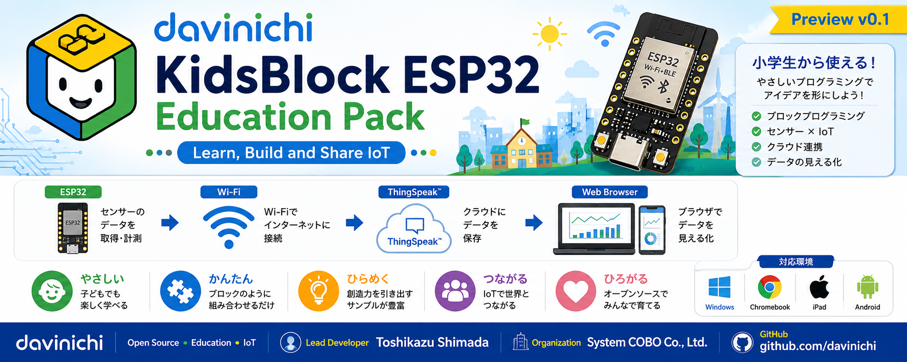

# KidsBlock ESP32 Education Pack

🌐 **Language**

- 🇺🇸 English (This page)
- 🇯🇵 Japanese → README_JA.md

---

# About KidsBlock ESP32 Education Pack

KidsBlock ESP32 Education Pack is an open-source educational project that provides IoT teaching materials for programming classes and maker workshops, from elementary school through high school.

The project offers easy-to-use extension libraries and educational resources for KidsBlock, making it simple to learn Wi-Fi communication, NTP clocks, sensors, cloud connectivity, and web browser visualization with ESP32.

Our goal is to help learners experience the complete IoT workflow: **Measure → Connect → Visualize → Apply**.

---

# 🚀 Quick Start

1. Read **INSTALL.md**
2. Download the latest Release
3. Run `install.bat`
4. Start KidsBlock Desktop
5. Upload a sample program to your ESP32 board

---

# ✨ Features

- SimpleWiFi
- NTPClock
- Environment (WBGT support)
- HTTP Server
- ThingSpeak

---

# 🎓 What You Can Learn

- Wi-Fi communication
- Internet clock (NTP)
- Temperature and humidity monitoring
- WBGT monitoring
- Web browser visualization
- ThingSpeak cloud connectivity
- IoT data utilization

---

# 📚 Documentation

- INSTALL.md — Installation Guide
- CHANGELOG.md — Version History
- RELEASE_NOTES.md — Release Information
- CONTRIBUTING.md — How to Contribute
- LICENSE — MIT License

---

# 🚧 Project Status

Current Version: **v0.1 Preview**

The project is under active development through classroom use and educational workshops.

---

# 💬 Feedback

Bug reports, suggestions, and educational ideas are welcome through GitHub Issues.

---

# License

This project is released under the **MIT License**.

See the `LICENSE` file for details.

---

**Project**

KidsBlock ESP32 Education Pack

**Brand**

davinichi

**Lead Developer**

Toshikazu Shimada

**Organization**

System COBO Co., Ltd.
